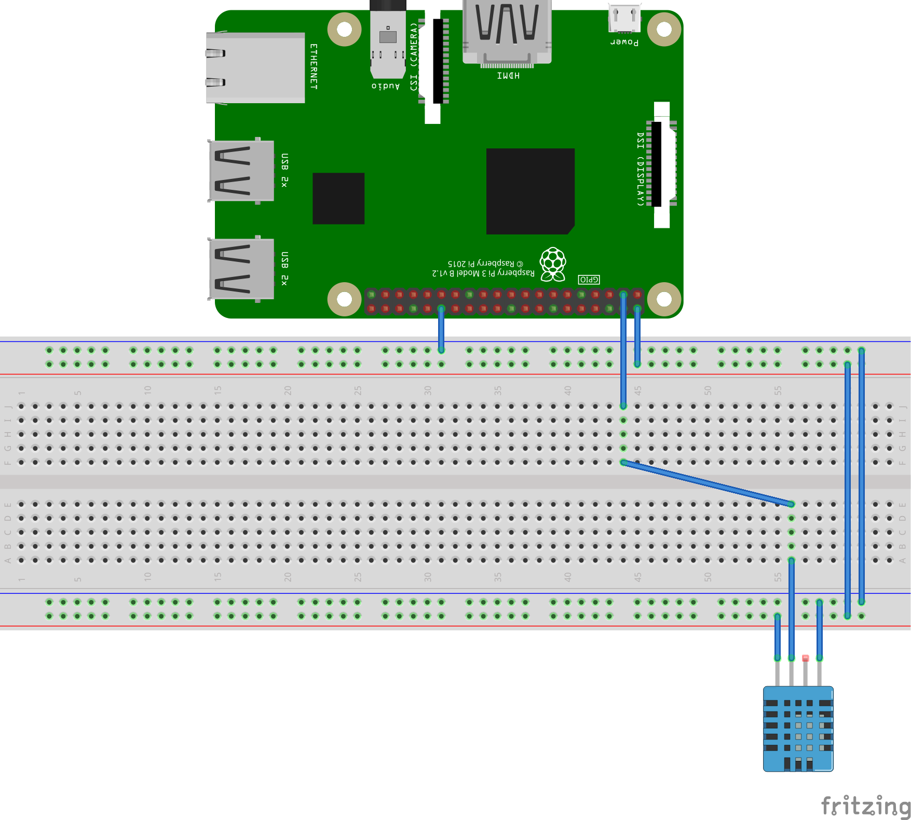

Skip to content
This repository
Search
Pull requests
Issues
Marketplace
Gist
 @elenat
 Sign out
 Unwatch 10
  Star 0
 Fork 0 Altoros/iiot_samples
 Code  Issues 0  Pull requests 0  Projects 0  Wiki  Settings Insights 
iiot_samples/http/ 
README.md
   or cancel
    
 Edit file    Preview changes
1
# Application level protocols: HTTP
2
This example shows an application which runs on Raspberry Pi and sends data from DHT-12 Temparature and Humidity Sensor module
3
​
4
## Software
5
* [Node.js 6+](https://nodejs.org/en/download/)
6
* [request](https://www.npmjs.com/package/request)
7
* [rpi-dht-sensor](https://www.npmjs.com/package/rpi-dht-sensor)
8
* [Docker](https://docs.docker.com/engine/installation/)
9
​
10
## Prepare hardware components
11
* Raspberry Pi 3 (Model B)
12
* Power Adapter (2A/5V)
13
* MicroSD Card (8GB+) and SD Adapter
14
* DHT-12 Temparature and Humidity Sensor module
15
* Breadboard and a set of dupont cables
16
* Ethernet cable for wired network connection
17
​
18
## Assemble the device
19

20
​
21
## Prepare SD card
22
* Download [the latest Raspbian LITE image](https://www.raspberrypi.org/downloads/raspbian/)
23
* Connect you SD card to your computer and use [Etcher](https://etcher.io/) to flash the Raspbian .img-file to the SD card
24
* Enable SSH:
25
  ```
26
  cd /Volumes/boot
27
  touch ssh
28
  ```
29
* To enable Wi-Fi create `wpa_supplicant.conf` with the following content:
30
  ```
31
  network={
32
      ssid="YOUR_SSID"
33
      psk="YOUR_WIFI_PASSWORD"
34
  }
35
  ```
36
* Create folder `/home/pi/sensor`
37
* Create file `/home/pi/sensor/package.json` with the following contents:
38
  ```
39
  {
40
    "name": "sensor",
41
    "version": "1.0.0",
42
    "description": "",
43
    "main": "index.js",
44
    "scripts": {
45
      "start": "node index.js",
46
      "test": "echo \"Error: no test specified\" && exit 1"
47
    },
48
    "author": "",
49
    "license": "ISC",
@elenat
Commit changes

Update README.md

Add an optional extended description…
  Commit directly to the master branch.
  Create a new branch for this commit and start a pull request. Learn more about pull requests.
Commit changes  Cancel
Contact GitHub API Training Shop Blog About
© 2017 GitHub, Inc. Terms Privacy Security Status Help
