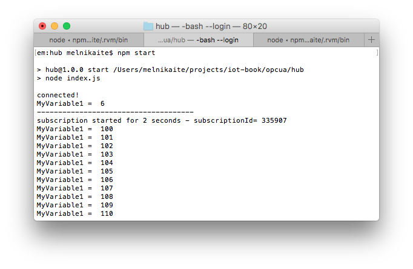
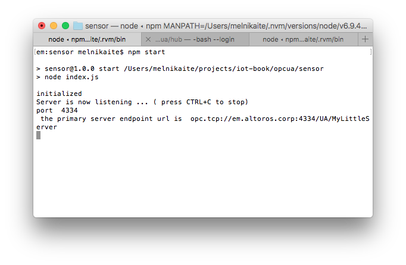
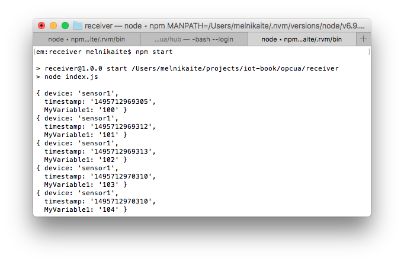

# Application level protocols: OPC UA
This example shows an application which runs on Raspberry Pi, collects data from OPC-UA simulator and sends the data to the cloud

## Software dependencies
* [Node.js 6+](https://nodejs.org/en/download/)
* [PostgreSQL](https://www.postgresql.org/download/)
* [CF CLI](https://github.com/cloudfoundry/cli#downloads)
* [request](https://www.npmjs.com/package/request)
* [node-opcua](https://www.npmjs.com/package/node-opcua)
* [async](https://www.npmjs.com/package/async)

## Prepare hardware components
* Raspberry Pi 3 (Model B)
* Power Adapter (2A/5V)
* MicroSD Card (8GB+) and SD Adapter
* Ethernet cable for wired network connection

## Prepare SD card
* [Burn Raspbian image](https://styxit.com/2017/03/14/headless-raspberry-setup.html)
* Create folder `/home/pi/hub`
* Create file `/home/pi/hub/package.json` with the following contents:
  ```
  {
    "name": "hub",
    "version": "1.0.0",
    "description": "",
    "main": "index.js",
    "scripts": {
      "start": "node index.js",
      "test": "echo \"Error: no test specified\" && exit 1"
    },
    "author": "",
    "license": "ISC",
    "dependencies": {
      "async": "^2.4.0",
      "node-opcua": "0.0.64",
      "request": "^2.81.0"
    }
  }
  ```
* Create file `/home/pi/hub/index.js` with the following contents, replacing `REMOTE-SERVER-ADDRESS.com` and `REMOTE-SENSOR-ADDRESS` with real values:
  ```
  /*global require,console,setTimeout */
  var opcua = require("node-opcua");
  var async = require("async");
  var request = require("request");

  var the_session, the_subscription;
  var client = new opcua.OPCUAClient();
  var sensor = "opc.tcp://REMOTE-SENSOR-ADDRESS:4334/UA/MyLittleServer";
  var receiver = "http://REMOTE-SERVER-ADDRESS.com:8080";

  async.series([

      // step 1 : connect to
      function (callback) {
        client.connect(sensor, function (err) {
          if (err) {
            console.log("cannot connect to endpoint :", sensor);
          } else {
            console.log("connected!");
          }
          callback(err);
        });
      },

      // step 2 : createSession
      function (callback) {
        client.createSession(function (err, session) {
          if (!err) {
            the_session = session;
          }
          callback(err);
        });
      },

      // step 3 : read a variable with readVariableValue
      function (callback) {
        the_session.readVariableValue("ns=1;s=MyVariable1", function (err, dataValue) {
          if (!err) {
            console.log("MyVariable1 = ", dataValue.value.value);
          }
          callback(err);
        });
      },

      // step 4 : set a variable with writeSingleNode
      function (callback) {
        the_session.writeSingleNode("ns=1;s=MyVariable1", new opcua.Variant({
          dataType: opcua.DataType.Double,
          value: 100
        }), function (err) {
          callback(err);
        });
      },

      // step 5: install a subscription and install a monitored item for 10 seconds
      function (callback) {
        the_subscription = new opcua.ClientSubscription(the_session, {
          requestedPublishingInterval: 1000,
          requestedLifetimeCount: 10,
          requestedMaxKeepAliveCount: 2,
          maxNotificationsPerPublish: 10,
          publishingEnabled: true,
          priority: 10
        });

        the_subscription.on("started", function () {
          console.log("subscription started for 2 seconds - subscriptionId=", the_subscription.subscriptionId);
        }).on("keepalive", function () {
          console.log("keepalive");
        }).on("terminated", function () {
          callback();
        });

        setTimeout(function () {
          the_subscription.terminate();
        }, 10000);

        // install monitored item
        var monitoredItem = the_subscription.monitor({
            nodeId: opcua.resolveNodeId("ns=1;s=MyVariable1"),
            attributeId: opcua.AttributeIds.Value
          },
          {
            samplingInterval: 100,
            discardOldest: true,
            queueSize: 10
          },
          opcua.read_service.TimestampsToReturn.Both
        );
        console.log("-------------------------------------");

        monitoredItem.on("changed", function (dataValue) {
          console.log("MyVariable1 = ", dataValue.value.value);

          //send to receiver
          var data = {
            device: 'sensor1',
            timestamp: Date.now(),
            MyVariable1: dataValue.value.value
          };
          request.post({url: receiver, form: data}, function (err) {
            if (err) console.log('Failed to send to ' + receiver);
          });
        });
      },

      // close session
      function (callback) {
        the_session.close(function (err) {
          if (err) {
            console.log("session closed failed ?");
          }
          callback();
        });
      }

    ],
    function (err) {
      if (err) {
        console.log("failure ", err);
      } else {
        console.log("done!");
      }
      client.disconnect(function () {
      });
    });
  ```
* Create folder `/home/pi/sensor`
* Create file `/home/pi/sensor/package.json` with the following contents:
   ```
  {
    "name": "sensor",
    "version": "1.0.0",
    "description": "",
    "main": "index.js",
    "scripts": {
      "start": "node index.js",
      "test": "echo \"Error: no test specified\" && exit 1"
    },
    "author": "",
    "license": "ISC",
    "dependencies": {
      "node-opcua": "0.0.64"
    }
  }
  ```
* Create file `/home/pi/sensor/index.js` with the following contents:
   ```
  /*global require,setInterval,console */
  var opcua = require("node-opcua");


  // Let's create an instance of OPCUAServer
  var server = new opcua.OPCUAServer({
      port: 4334, // the port of the listening socket of the server
      resourcePath: "UA/MyLittleServer", // this path will be added to the endpoint resource name
       buildInfo : {
          productName: "MySampleServer1",
          buildNumber: "7658",
          buildDate: new Date(2014,5,2)
      }
  });

  function post_initialize() {
      console.log("initialized");
      function construct_my_address_space(server) {

          var addressSpace = server.engine.addressSpace;

          // declare a new object
          var device = addressSpace.addObject({
              organizedBy: addressSpace.rootFolder.objects,
              browseName: "MyDevice"
          });

          // add some variables
          // add a variable named MyVariable1 to the newly created folder "MyDevice"
          var variable1 = 1;

          // emulate variable1 changing every 500 ms
          setInterval(function(){  variable1+=1; }, 500);

          addressSpace.addVariable({
              componentOf: device,
              nodeId: "ns=1;s=MyVariable1", // a string nodeID
              browseName: "MyVariable1",
              dataType: "Double",
              value: {
                  get: function () {
                      return new opcua.Variant({dataType: opcua.DataType.Double, value: variable1 });
                  },
                  set: function (variant) {
                      variable1 = parseFloat(variant.value);
                      return opcua.StatusCodes.Good;
                  }
              }
          });
      }
      construct_my_address_space(server);
      server.start(function() {
          console.log("Server is now listening ... ( press CTRL+C to stop)");
          console.log("port ", server.endpoints[0].port);
          var endpointUrl = server.endpoints[0].endpointDescriptions()[0].endpointUrl;
          console.log(" the primary server endpoint url is ", endpointUrl );
      });
  }
  server.initialize(post_initialize);
   ```

## Run hub application on RPi
* Insert SD card into the RPi
* Connect Ethernet cable and open SSH connection
* Navigate to `/home/pi/hub` and install dependencies:
  ```
  # Install Node.js
  curl -sL https://deb.nodesource.com/setup_6.x | sudo -E bash - sudo apt-get install -y nodejs
  # Install dependencies
  npm install
  ```
* Finally, launch the application with `npm start`:
  

## Run simulator application on RPi
* Open SSH connection
* Navigate to `/home/pi/sensor` and install dependencies:
  ```
  npm install
  ```
* Finally, launch the application with `npm start`:
  

## Run the receiver application on your PC
* Install and launch PostgreSQL
* Create folder `receiver`
* Create file `./receiver/package.json` with the following contents:
   ```
  {
    "name": "receiver",
    "version": "1.0.0",
    "description": "",
    "main": "index.js",
    "scripts": {
      "start": "node index.js",
      "test": "echo \"Error: no test specified\" && exit 1"
    },
    "author": "",
    "license": "ISC",
    "dependencies": {
      "pg": "^6.2.3"
    }
  }
  ```
* Create file `./receiver/index.js` with the following contents, replacing database credentials with the correct ones:
   ```
  var http = require('http');
  var querystring = require('querystring');
  var Pool = require('pg').Pool;
  var pool = new Pool({
    user: 'user',
    database: 'database',
    password: 'password',
    host: 'host',
    port: 5432
  });

  //ensure table exists in db
  pool.query('CREATE TABLE IF NOT EXISTS "sensor-logs" (id serial NOT NULL PRIMARY KEY, data json NOT NULL)', function (err, result) {
    if (err) console.log(err);
  });

  http.createServer(function (req, res) {
    req.on('data', function (chunk) {
      var data = querystring.parse(chunk.toString());
      console.log(data);

      //save in db
      pool.query('INSERT INTO "sensor-logs" (data) VALUES ($1)', [data], function (err, result) {
        if (err) console.log(err);
      });
    });
    req.on('end', function () {
      res.writeHead(200, 'OK', {'Content-Type': 'text/html'});
      res.end('ok')
    });
  }).listen(process.env.PORT || 8080);
   ```
* Install dependencies:
  ```
  npm install
  ```
* Finally, launch the application with `npm start`:
  

## Run the receiver in the Predix
* Install and point CF CLI to your Predix account
* Create PostgreSQL service and obtain credentials
* Create file `./receiver/manifest.yml` with the following contents:
   ```
  applications:
  -
    name: receiver
    memory: 128M
    random-route: true
   ```
* Replace database credentials in `./receiver/index.js`
* Deploy to the cloud:
  ```
  cf push
  ```
* Change the REMOTE-SERVER-ADDRESS in `hub` application on RPi to the newly deployed `receiver`
