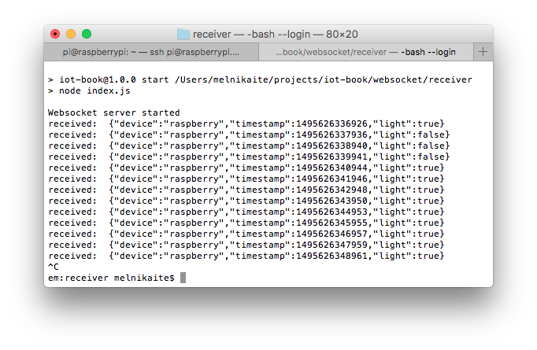

# Application level protocols: WebSocket
This example shows an application which runs on Raspberry Pi and sends data from XD-80 Light Sensor module

## Software dependencies
* [Node.js 6+](https://nodejs.org/en/download/)
* [rpio](https://www.npmjs.com/package/rpio)
* [ws](https://www.npmjs.com/package/ws)

## Prepare hardware components
* Raspberry Pi 3 (Model B)
* Power Adapter (2A/5V)
* MicroSD Card (8GB+) and SD Adapter
* XD-80 Light Sensor module
* Breadboard and a set of dupont cables
* Ethernet cable for wired network connection

## Assemble the device


## Prepare SD card
* [Burn Raspbian image](https://styxit.com/2017/03/14/headless-raspberry-setup.html)
* Create folder `/home/pi/sensor`
* Create file `/home/pi/sensor/package.json` with the following contents:
  ```
  {
    "name": "sensor",
    "version": "1.0.0",
    "description": "",
    "main": "index.js",
    "scripts": {
      "start": "node index.js",
      "test": "echo \"Error: no test specified\" && exit 1"
    },
    "author": "",
    "license": "ISC",
    "dependencies": {
      "rpio": "^0.9.16",
      "ws": "^2.3.1"
    }
  }
  ```
* Create file `/home/pi/sensor/index.js` with the following contents, replacing `REMOTE-SERVER-ADDRESS.com` with real value:
  ```
  var WebSocket = require('ws');
  var rpio = require('rpio');

  var ws;
  var receiver = 'ws://REMOTE-SERVER-ADDRESS.com:8080';
  rpio.open(11, rpio.INPUT);

  var establishConnection = function () {
    ws = new WebSocket(receiver);
    ws.on('close', establishConnection);
    ws.on('error', establishConnection);
  };
  establishConnection();

  var sendStatus = function () {
    var status = rpio.read(11) === 0;
    console.log('light status: ' + status);

    var data = JSON.stringify({
      device: 'raspberry',
      timestamp: Date.now(),
      light: status
    });

    try { ws.send(data); }
    catch (e) { console.log('failed to send data to ' + receiver); }

    setTimeout(sendStatus, 1000);
  };
  sendStatus();
  ```

## Run the sensor application on RPi
* Insert SD card into the RPi
* Connect Ethernet cable and open SSH connection
* Navigate to `/home/pi/sensor` and install dependencies:
  ```
  # Install Node.js
  curl -sL https://deb.nodesource.com/setup_6.x | sudo -E bash - sudo apt-get install -y nodejs
  # Install dependencies
  npm install
  ```
* Finally, launch the application with `npm start`:
  

## Run the receiver application on your PC
* Create folder `receiver`
* Create file `./receiver/package.json` with the following contents:
   ```
  {
    "name": "receiver",
    "version": "1.0.0",
    "description": "",
    "main": "index.js",
    "scripts": {
      "start": "node index.js",
      "test": "echo \"Error: no test specified\" && exit 1"
    },
    "author": "",
    "license": "ISC",
    "dependencies": {
      "ws": "^2.3.1"
    }
  }
  ```
* Create file `./receiver/index.js` with the following contents:
   ```
  const WebSocket = require('ws');

  const wss = new WebSocket.Server({port: 8080}, function () {
    console.log('Websocket server started');
  });

  wss.on('connection', function connection(ws) {
    ws.on('message', function incoming(message) {
      console.log('received: ', message);
    });

    // Send message to connected client
    ws.send('hello, client');
  });
   ```
* Install Nodejs and dependencies:
  ```
  # Consult your PC platform docs for Node.js install
  npm install
  ```
* Finally, launch the application with `npm start`:
  
